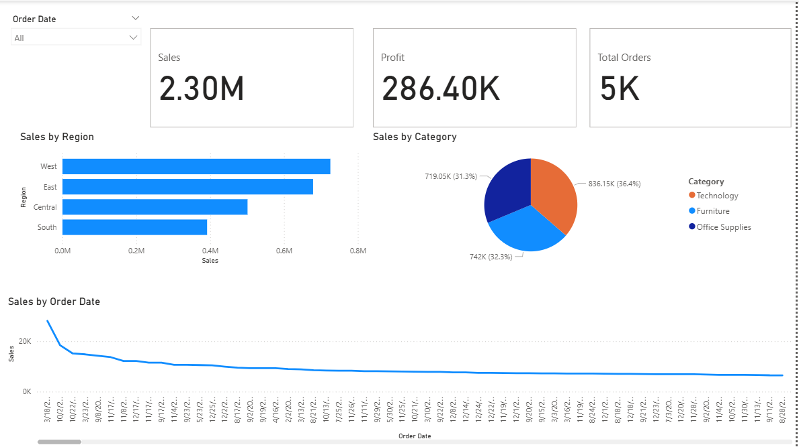

# 🛒 Superstore Sales Dashboard — Power BI

> Interactive sales dashboard built using the Superstore dataset

---

## 📊 Dashboard Overview

---

## 📋 Key Metrics Tracked

| KPI | Value |
|---|---|
| 💰 Total Sales | $2.30M |
| 📈 Total Profit | $286.40K |
| 📦 Total Orders | 5,009 |

---

## 📌 Visuals Included

- 💰 **Total Sales** KPI Card
- 📈 **Total Profit** KPI Card
- 📦 **Total Orders** KPI Card
- 🌍 **Sales by Region** Bar Chart
- 🥧 **Sales by Category** Pie Chart
- 📉 **Monthly Sales Trend** Line Chart
- 🔽 **Year Slicer** for filtering

---

## 🛠️ Tools Used
- Power BI Desktop
- DAX Measures
- Superstore Public Dataset

---

## 🤝 Connect with Me
- 💼 [LinkedIn](https://linkedin.com/in/sadhana-s-kumar)
- 📧 sanasadhana07@gmail.com
- 🐙 [GitHub Profile](https://github.com/sadhana007)
